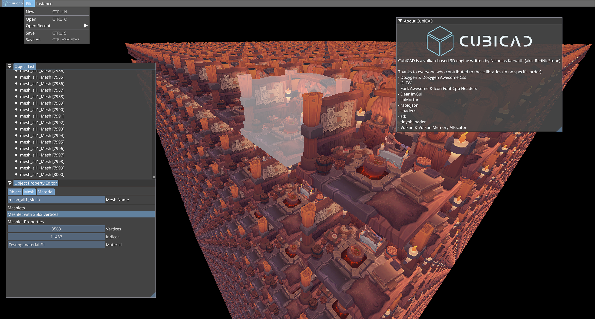

\


---
[]()
[]()
[]()

[]()
[]()
[]()
[]()
[]()

### A fast and modern vulkan rendering engine



At the moment in **heavy development** and barely usable at its current state.

## Features

- Indirect Rendering for maximum draw performance
- An advanced material and shading system
- Fully featured UI with object picking using ImGUI
- 100% dynamic object properties
  - Want to change the material? Done. In the same frame
  - Change the model? As often as you please
  - Want to change textures? Do it every frame!
- Advanced sparse scene graph
  - Tired of optimizing for drawcalls? Done automatically every frame
  - Afraid of overshading? Won't ever happen with CubiCAD's deferred shading pipeline
  - Rendering to many objects? With CubiCAD you can easily render more than to 1 million objects per second
- Fully fledged multistage pipeline
  - Tired of ordering your vertices for culling? CubiCAD uses compute shader based normal culling
  - Easily extend the rendering pipeline using the provided c++ modules
  - Render nth degree camera perspectives within the same pipeline for all the portals and cameras you want
- CubiCAD saves performance and prevent memory leaks by **allocating exclusively on the heap**
- And of course **fully open source**!!

## Building
The project can be built using CMake and gcc.\
All project dependencies except for vulkan, cmake, std libraries and gcc should be included in this repository.\
**MAKE SURE YOU HAVE THE VULKAN SDK INSTALLED BEFORE BUILDING**. You can download lunarG's version [there](https://www.lunarg.com/vulkan-sdk/).

First, start by cloning the repository:
```shell
git clone --recurse-submodules -j8 https://github.com/RedNicStone/CubiCAD.git
cd CubiCAD
```

Create a build directory and run CMake:
```shell
mkdir build
cd build
cmake ..
```

Finally build the project and run the binary:
```shell
make
chmod +x CubiCAD
./CubiCAD
```
